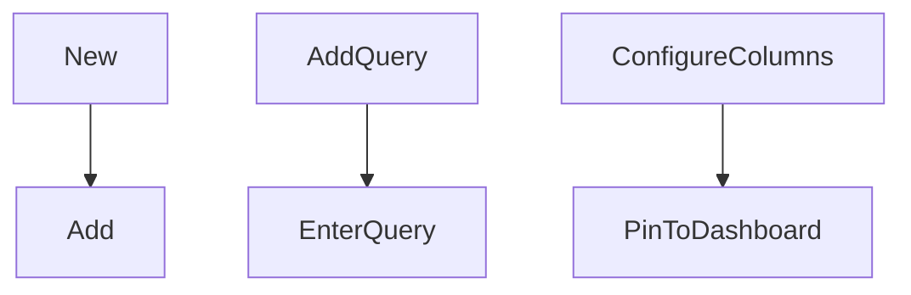

# Azure Workbooks


## Create Workbook



New

Add

Add Query

Enter Kusto Query saved from Log Analytics
Select your log analytics workspace
Run Query
Column Settings
Change column rendered to Thresholds
For Example network status choose

Contains Health
Contains Unhealthy
Becareful here as these entries are case sensitive.
They are evaluated from the top down and the first matching is used.
Press Apply
Save and Close

Advanced Settings "no data message style"
Make this item conditionally visible


column settings default

column settsins one

Column settings all

Using labels to change the column names (I would recommend doing this part in Kusto

Separate workbooks for each query or one workbook for all.
Split the workbooks based on source or target

Some you might want to display in multiple places


Add time restriction to show one per

Kusto make-series and sparklines for some more advanced effects

JSON Snippet for Network Status workbook


```
{
  "type": 3,
  "content": {
    "version": "KqlItem/1.0",
    "query": "Event \n| where Source == \"SRS-App\" and EventID == 2001\n| extend d=parse_json(RenderedDescription) \n| extend Description=d.Description\n| project Computer, TimeGenerated,\nNetworkStatus=replace_string(replace_string(tostring(NetworkStatus=split(Description,\".\",0)),'\"]',\"\"),'[\"Network status : ',\"\"),\nExchangeStatus=replace_string(replace_string(tostring(ExchangeStatus=split(Description,\".\",1)),'\"]',\"\"),'[\" Exchange status : ',\"\"),\nSigninStatus=replace_string(replace_string(tostring(SigninStatus=split(Description,\".\",2)),'\"]',\"\"),'[\" Signin status:',\"\"),\nTeamsSigninStatus=replace_string(replace_string(tostring(TeamsSigninStatus=split(Description,\".\",3)),'\"]',\"\"),'[\" Teams Signin status: ',\"\")\n| summarize  any(TimeGenerated) by Computer, NetworkStatus, ExchangeStatus, SigninStatus, TeamsSigninStatus\n| where NetworkStatus != \"Healthy\"\n| project Computer, any_TimeGenerated\n",
    "size": 1,
    "title": "Network status Issues",
    "noDataMessage": "No network issues",
    "noDataMessageStyle": 3,
    "timeContext": {
      "durationMs": 86400000
    },
    "queryType": 0,
    "resourceType": "microsoft.operationalinsights/workspaces"
  },
  "name": "Network status"
}
```


